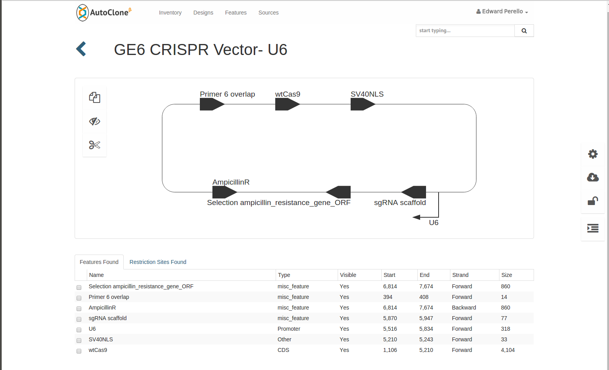

# Examples of DNA Molecule Diagrams

Here are a few example diagrams.

1. This example comes from DeskGen's AutoClone application. It uses the SBOL 
visual symbols to show the high level features, but don't show the full sequence
or allow the user to zoom in.
